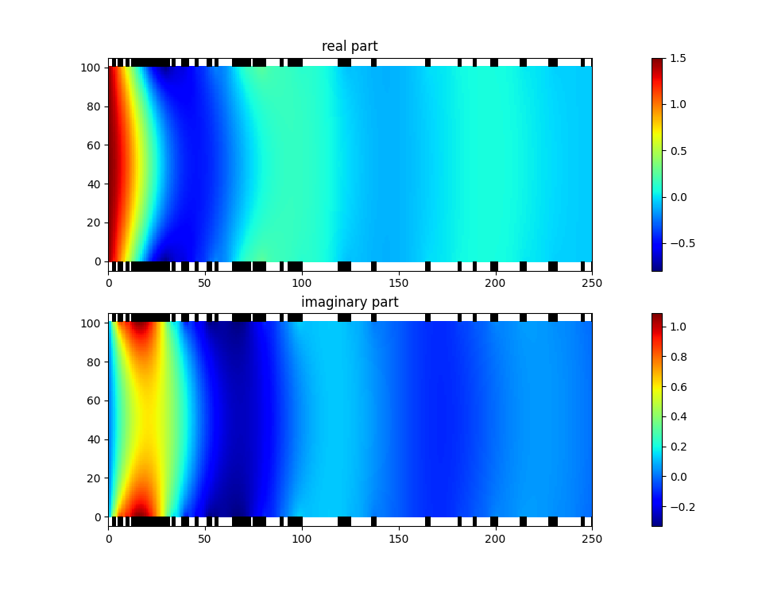
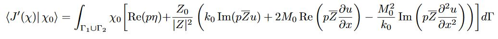
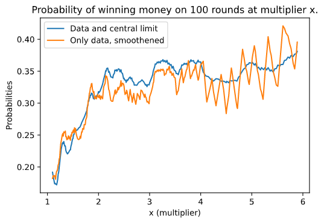
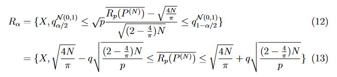
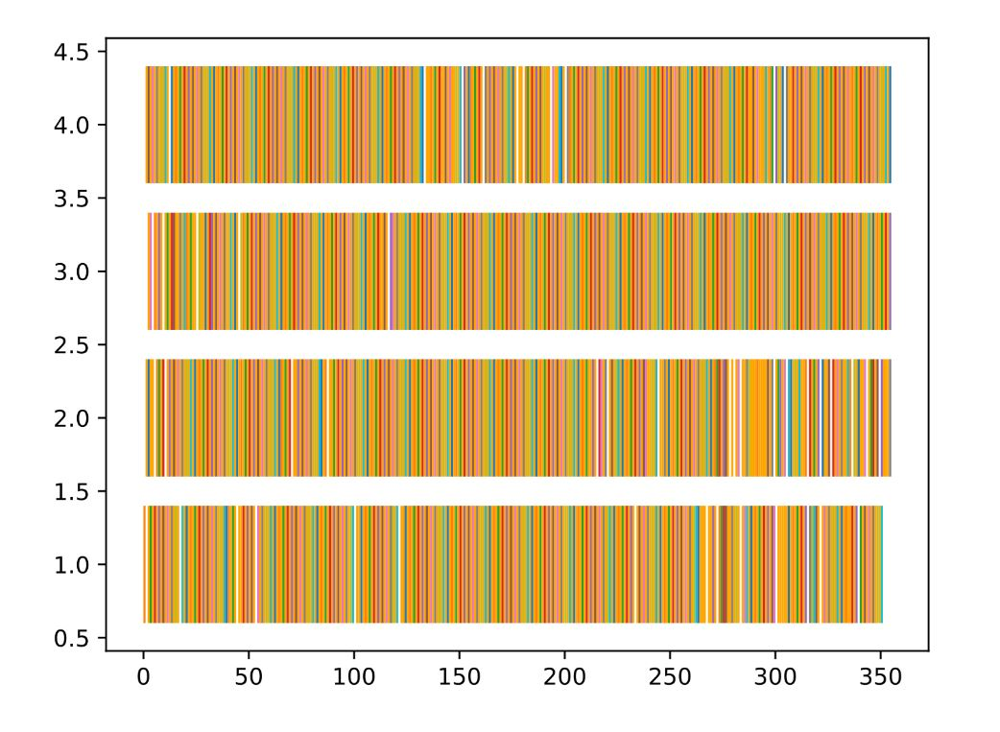

# Paul Hainsselin Profile
## About me
* Paul Hainsselin
* 21 Earth laps around the sun
* Machine Learning Engineer and Mathematician


I'm currently in a double diploma Msc by research at the **National University of Singapore**. I have studied in French top Engineering School **Centrale Supélec** for my Masters degree, focusing on fundamental Mathematics and Engineering. I hold a Bachelor's degree in mathematics from the [#1 school in mathematics in the world ](https://www.shanghairanking.com/rankings/gras/2021/RS0101), **Université Paris-Saclay**. I have studied in the intense _Classe Préparatoire aux Grandes Ecoles (CPGE)_ **Lycée Thiers** for 2 years to prepare for the entrance examination for Engineering School.

> My main motivation is to make models that will one day impress the world


## Mathematics projects

Here is a small sample of the projects related to mathematics that I have worked on.

### Onera Liner Optimisation

Optimizing the accoustic liner repartition in a plane engine to minimize the noise percieved in cities by planes. Given a budget equal to a fraction of the available area, develop analytical and numerical tools to find the best repartition of the liner over the propulser's contour.

> The optimized liner repartition using genetic algorithm.


<br/>

> The Form derivation obtained on Helmoltz Equation for the first time in our paper.



[Link to the LateX report](https://xwkya.github.io/rapport_projet_S8(2).pdf)

### JetX - Gambling website statistics

Scraping and analysis of thousands of data about a specific online casino game. Attempt to predict the data with a RNN depending on the total amount at stake and the number of players. No correlation found.

> Sample of analysis made
> 
> 


[Link to the LateX report](https://xwkya.github.io/JetX(4).pdf)


### Record Theory \[French report\]

Development of a statistical test on data distribution based on number of records. Analysis of best permutation sample to augment the data.

>Statistical test formula based on the number of records


[Link to the LateX report (In french)](https://xwkya.github.io/Stats_des_records.pdf)

## Machine Learning Projects

### Amazon comments sentiment analysis

Notebook to learn how to process sentences using lemmatization, embedding, SBERT preprocessing and LSTM cells. One of the other aspect is cleaning and working with huge amount of data. The final product is fun to play with and the high-low accuracy (binary classification >=4 stars or <=3 stars) is 90%.

> The user can input his own comment and the model will predict how many stars the user would have assigned based on the comment.

```python
sentence_pred_batch("Although I thought it would be funny, I was a bit\
      disappointed by the poor performance of the actors and the gross jokes.")
 >>> 2.52000
 
high_low_accuracy=(np.sum(confusion_matrix[:3,:3])+np.sum(confusion_matrix[3:,3:]))/np.sum(confusion_matrix)
print("high/low accuracy: ", high_low_accuracy)
 >>> high/low accuracy:  0.89588
```

[Link to the ipynb file](https://github.com/xwkya/xwkya.github.io/blob/main/amazon_sentiment_analysis.ipynb)

### GENETIC ALGORITHMS FOR TASKS SCHEDULING PROBLEM

Optimizing the schedule of tasks with dependencies on N processors using Genetic Algorithms and scaling the computations using Microsoft Message Passing Interface. The crossovers and mutations are made leveraging careful cuts on topological sorts.

> Workload of the tasks on 4 processors, empty slots mean that no task can be executed because the dependencies are not ready.
> 

[Link to the LateX report](https://xwkya.github.io/ST7_long_report.pdf)

### Mosaic Project

Work in progress. Create a mosaic from an image and a possible tileset of replacements. Optimizing with Neural Netwok policy. Exploring other possible uneven mosaics.

> Example of a mosaic
> 
> 


## Fun Projects

### Live Sudoku Solver

Just put a sudoku in front of your camera and watch the code solve. The solving process is slowed to let the user see the workings of the algorithm.

<p align='center'>
<iframe width="560" height="315" src="https://www.youtube.com/embed/8zYfBG6oP3A" title="YouTube video player" frameborder="0" allow="accelerometer; autoplay; clipboard-write; encrypted-media; gyroscope; picture-in-picture" allowfullscreen></iframe>
</p>
      
[Github repo](https://github.com/xwkya/sudoku-solver)

### Binary 17-bit calculator

Made this calculator on the famous game Minecraft when I was 15 years old (Old video for dating purpose, muting the volume is recommended)
<p align='center'>
<iframe width="560" height="315" src="https://www.youtube.com/embed/ymo-nCiln8M" title="YouTube video player" frameborder="0" allow="accelerometer; autoplay; clipboard-write; encrypted-media; gyroscope; picture-in-picture; web-share" allowfullscreen></iframe>
</p>

